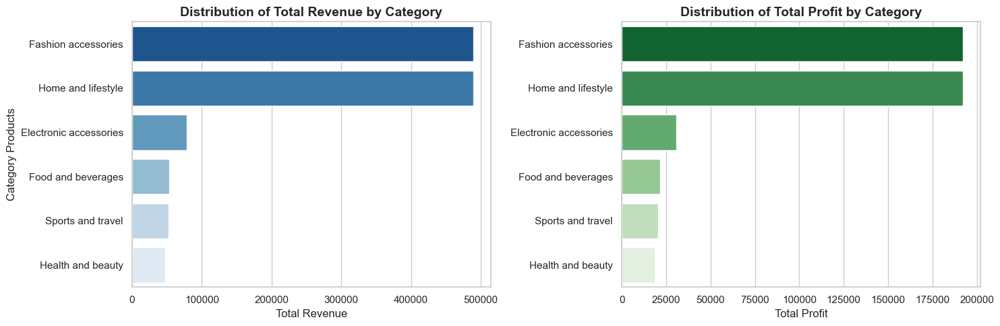
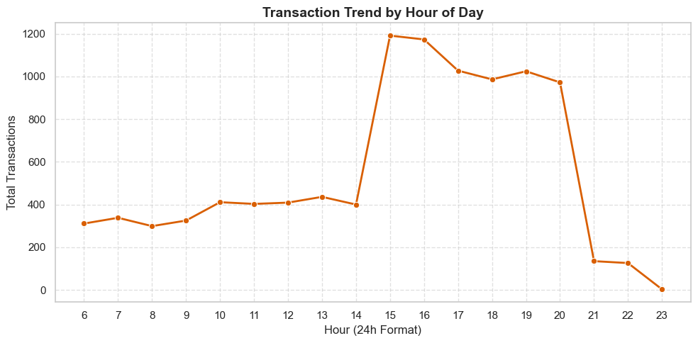
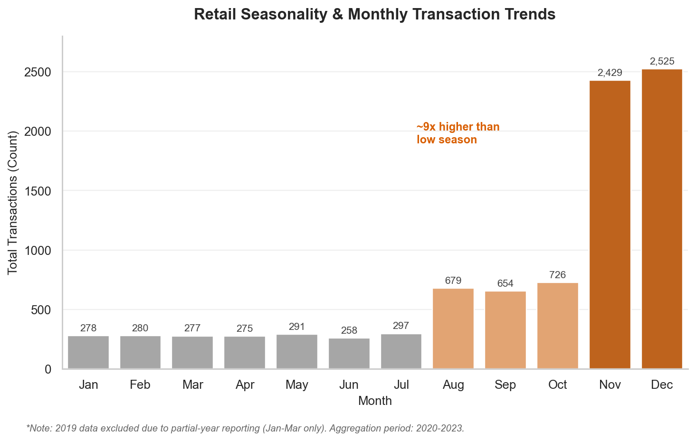

**🇬🇧 English** | [🇮🇩 Bahasa Indonesia](./README.id.md)

# 📊 Walmart Retail Operations Analysis — Validated Business Insights

[](#)
[](#)
[](#)

A SQL + Python analysis of Walmart branch transaction data, uncovering operational patterns in staffing, seasonality, and branch performance — with a deliberate focus on statistically sound conclusions.

**Data source:** Walmart retail transaction dataset (Kaggle)

---

## 📑 Table of Contents

- [Key Highlights](#-key-highlights)
- [About This Project](#-about-this-project)
- [Tech Stack](#-tech-stack)
- [Analytical Rigor](#-analytical-rigor-what-sets-this-apart)
- [Key Findings](#-key-findings)
- [Sample Results](#-sample-results)
- [How to Run](#️-how-to-run)
- [Contact](#-contact)

---

## 📸 Key Highlights







---

## 📌 About This Project

**Objective:** 

To identify revenue trends, evaluate product category performance, and map customer shopping patterns across Walmart branches — translating raw transaction data into actionable recommendations for labor scheduling, inventory planning, and marketing calendar alignment.

**Methodology:** 

Data was extracted and aggregated using PostgreSQL queries to answer specific operational business questions, then processed with Pandas and visualized with Matplotlib/Seaborn in Python.

<details>
<summary><strong>📁 Repo Structure</strong> (click to expand)</summary>

```
walmart-retail-analytics-validated/
├── README.md
├── LICENSE
├── .gitignore
├── requirements.txt
├── assets/
│   ├── 01_revenue_by_category.png
│   ├── 02_hourly_trend.png
│   └── 03_monthly_seasonality.png
├── data/
│   ├── Walmart.csv
│   └── walmart_clean_data.csv
└── Walmart_sales_analysis_project.ipynb
```

Database credentials are loaded from a local `.env` file (not committed to this repo) via `python-dotenv` — see [How to Run](#️-how-to-run) for setup.

</details>

---

## 🧩 Tech Stack

| Category | Tools |
|---|---|
| **Database** | PostgreSQL |
| **Language** | Python |
| **Libraries** | Pandas (data manipulation), SQLAlchemy (DB connection), Matplotlib & Seaborn (visualization), python-dotenv (credential management) |
| **Environment** | Jupyter Notebook |

---

## 🔍 Analytical Rigor

During analysis, two methodological issues were identified and corrected before finalizing conclusions:

| Issue Found | Problem | Fix Applied |
|---|---|---|
| **Small sample size in branch-level YoY comparison** | Several branches appeared to show a "60% revenue decline," but the underlying transaction counts were as low as 7-19 per year — far too small to be a reliable signal | Added a minimum sample size threshold (≥20 transactions/year) to flag which declines are statistically meaningful vs. likely noise |
| **Partial-year data bias in monthly seasonality** | 2019 only contains January-March records; including it in a monthly aggregate would artificially inflate Q1 figures relative to other months | Excluded 2019 from the monthly seasonality analysis, using only complete years (2020-2023) for a fair month-to-month comparison |

This second fix also led to the **strongest finding in the entire analysis** — a ~9x spike in transaction volume during November-December.

---

## 📊 Key Findings

### 1️⃣ Monthly Seasonality
**Methodology:** Transaction volume by month, aggregated across 2020-2023 (2019 excluded as a partial year).

**Findings:** November and December show a dramatic spike — roughly **9x higher** than the low season (Jan-Jul). August-October show a moderate secondary rise, likely a pre-holiday buildup period.

**Insight:** This is the single strongest seasonal pattern in the dataset — far more pronounced than the intraday (hourly) pattern — and strongly suggests a holiday shopping season effect (Black Friday, Christmas), consistent across all observed years.

**Recommendation:** Begin scaling up stock levels and temporary staffing from October, with peak readiness by November 1st. Concentrate promotional campaigns and ad spend in the Aug-Dec window rather than spreading budget evenly across the year.

### 2️⃣ Hourly Transaction Pattern
**Methodology:** Transaction volume by hour of day, aggregated across the full dataset.

**Findings:** Volume stays flat (300-400 transactions) from 06:00-14:00, then spikes sharply to ~1,200 transactions from 15:00 onward, staying elevated until 20:00.

**Insight:** Customer activity is concentrated in a five-hour evening window, disproving the assumption that stores peak during the lunch hour. This is likely driven by post-work shopping habits.

**Recommendation:** Reduce morning staffing to a functional minimum; concentrate manpower and restocking schedules around the 15:00-20:00 window to prevent checkout bottlenecks.

### 3️⃣ Category Revenue & Profit
**Methodology:** Total revenue and profit by product category.

**Findings:** Fashion Accessories and Home & Lifestyle generate the highest total profit — driven by significantly higher transaction volume (10x+ more transactions than underperforming categories), not by higher profit margins. Margins are actually similar (~39-40%) across all categories.

**Insight:** Category "dominance" here is a volume story, not a margin story — an important distinction for floor space and inventory decisions.

**Recommendation:** Expand physical floor space for high-volume categories; avoid assuming higher margin as the driver when reallocating inventory investment.

### 4️⃣ Branch-Level YoY Revenue Decline
**Methodology:** Year-over-year revenue comparison per branch (2022 vs. 2023), with a minimum sample size flag (≥20 transactions/year) added to distinguish reliable signals from noise.

**Findings:** Several branches show an apparent revenue decline, but most have very low annual transaction counts (often under 20), making the percentage changes statistically unreliable at the individual branch level.

**Insight:** Without this check, low-volume branches could have been misreported as operational "crises" based on a handful of transactions.

**Recommendation:** Prioritize branches meeting the minimum sample size threshold for investigation; treat findings from low-volume branches as preliminary signals requiring more data before action is taken.

### 5️⃣ Payment Method & Customer Satisfaction
**Findings:** Credit cards lead overall (4,200+ transactions), but e-wallets are the top choice at the branch level in most locations — cash lags well behind both. Satisfaction ratings are highly location-dependent (e.g. "Health and beauty" scores 9.8 at one branch vs. 6.9 at another for the same category).

**Insight:** Digital payment infrastructure should be prioritized company-wide, while service quality issues appear to be branch-specific rather than systemic — supporting a tailored, per-branch service audit rather than a blanket policy.

---

## 📄 Sample Results

| File | Contents |
|---|---|
| [`walmart_sales_analysis_project.ipynb`](./walmart_sales_analysis_project.ipynb) | Full notebook: data cleaning, SQL queries, visualizations, and business interpretation for every finding above |

---

## 🛠️ How to Run

1. Clone this repository.
2. Install dependencies: `pip install -r requirements.txt`
3. Set up a local PostgreSQL database and load the dataset from `data/`.
4. Create a `.env` file in the project root (this file is not included in the repo — see `.gitignore`) with the following variables:
   ```
   DB_USER=your_postgres_username
   DB_PASSWORD=your_postgres_password
   DB_HOST=localhost
   DB_PORT=5432
   DB_NAME=your_database_name
   ```
5. Open `Walmart_sales_analysis_project.ipynb` and run all cells sequentially.

---

## 📬 Contact

Open to discussion, feedback, or collaboration opportunities related to this project.

- **LinkedIn:** [linkedin.com/in/gloryanisveronicalase](https://linkedin.com/in/gloryanisveronicalase)
- **Email:** gloryanislase@gmail.com
